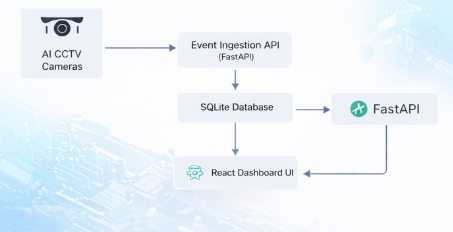
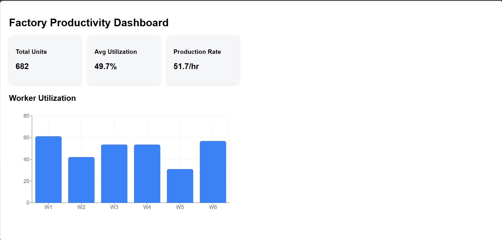
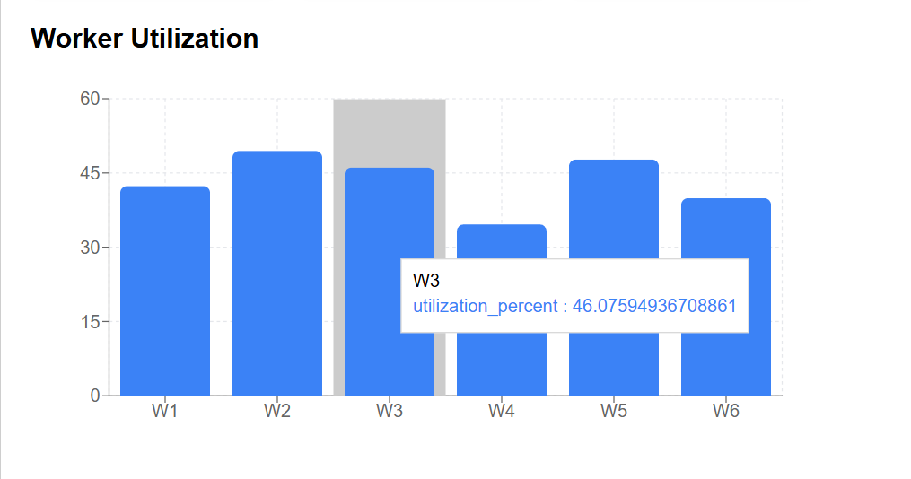
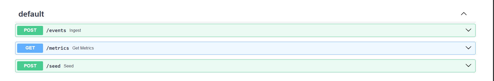

🚀 Live Demo | 📊 Dashboard | 🧠 AI Analytics | 🐳 Dockerized

# 🏭 AI-Powered Worker Productivity Dashboard

An end-to-end **AI analytics web application** that ingests structured events generated by AI CCTV systems, computes productivity metrics, and visualizes factory performance through an interactive dashboard.

This project simulates a real-world **smart manufacturing monitoring system** where computer vision models analyze worker activity and provide operational insights.

---

## 🚀 Live System Overview

The system processes AI-generated worker activity events and transforms them into actionable factory productivity metrics.

### Key Capabilities

* 📡 AI event ingestion API
* 🗄 Persistent event storage
* 🧠 Time-based productivity computation
* 📊 Interactive analytics dashboard
* 🐳 Dockerized backend deployment
* ⚡ Real-time dashboard updates

---

## 🏗 Architecture Overview

### Edge → Backend → Dashboard Flow

```
AI CCTV Cameras (Edge AI)
            │
            ▼
     Event Ingestion API
        (FastAPI)
            │
            ▼
        SQLite Database
            │
            ▼
       Metrics Engine
            │
            ▼
      React Dashboard UI
```

---

### Architecture Diagram



---

## ⚙️ Tech Stack

| Layer            | Technology              |
| ---------------- | ----------------------- |
| Frontend         | React + Vite + Recharts |
| Backend          | FastAPI (Python)        |
| Database         | SQLite                  |
| ORM              | SQLAlchemy              |
| Containerization | Docker                  |
| Visualization    | Recharts                |

---

## 📦 Project Structure

```
ai-productivity-dashboard/
│
├── backend/
│   ├── app/
│   │   ├── main.py
│   │   ├── models.py
│   │   ├── metrics.py
│   │   ├── seed.py
│   │   └── routes/
│
├── frontend/
│   └── src/
│       └── components/
│           └── Dashboard.jsx
│
├── docker-compose.yml
├── architecture.png
└── README.md
```

---

## 🧪 Sample Factory Setup

The system simulates:

* **6 Workers**
* **6 Workstations**
* AI-generated activity events

### Event Example

```json
{
  "timestamp": "2026-01-15T10:15:00Z",
  "worker_id": "W1",
  "workstation_id": "S3",
  "event_type": "working",
  "confidence": 0.93,
  "count": 1
}
```

### Supported Event Types

* `working`
* `idle`
* `absent`
* `product_count`

---

## 🗄 Database Schema

### Workers

| Field     | Description              |
| --------- | ------------------------ |
| worker_id | Unique worker identifier |
| name      | Worker name              |

### Workstations

| Field      | Description           |
| ---------- | --------------------- |
| station_id | Unique workstation ID |
| name       | Station type/name     |

### Events

| Field          | Description       |
| -------------- | ----------------- |
| timestamp      | Event time        |
| worker_id      | Worker reference  |
| workstation_id | Station reference |
| event_type     | Activity type     |
| confidence     | Model confidence  |
| count          | Units produced    |

---

## 📊 Metrics Computed

### 👷 Worker-Level Metrics

* Total Active Time
* Total Idle Time
* Utilization Percentage
* Total Units Produced
* Units per Hour

**Utilization Formula**

```
Utilization = Active Time / (Active + Idle Time)
```

---

### 🏭 Workstation-Level Metrics

* Occupancy Time
* Utilization Percentage
* Total Units Produced
* Throughput Rate

---

### 🏢 Factory-Level Metrics

* Total Productive Time
* Total Production Count
* Average Utilization
* Average Production Rate

---

## ⏱ Time Assumptions

Event duration is calculated as:

```
Duration = Time until next event for same worker
```

Example:

| Time  | Event   |
| ----- | ------- |
| 10:00 | working |
| 10:05 | idle    |

Working duration = **5 minutes**

---

## 🔌 API Endpoints

| Method | Endpoint   | Description               |
| ------ | ---------- | ------------------------- |
| POST   | `/events`  | Ingest AI event           |
| POST   | `/seed`    | Generate demo data        |
| GET    | `/metrics` | Fetch dashboard metrics   |
| GET    | `/docs`    | Swagger API documentation |

---

## ▶️ Running Locally

### 1️⃣ Start Backend

```bash
docker compose up --build
```

---

### 2️⃣ Seed Data

Open:

```
http://localhost:8000/docs
```

Run:

```
POST /seed
```

---

### 3️⃣ Start Frontend

```bash
cd frontend
npm install
npm run dev
```

Open:

```
http://localhost:5173
```

---

## 📸 Dashboard Screenshots

### Factory Overview



### Worker Utilization Chart



### API Documentation



*(Add screenshots into `/screenshots` folder)*

---

## 🛠 Handling Real-World Challenges

### Intermittent Connectivity

* Events designed to be idempotent
* Timestamp-based ordering
* Safe retries supported

---

### Duplicate Events

Database constraint:

```
(timestamp + worker_id + event_type)
```

prevents duplicate ingestion.

---

### Out-of-Order Events

Events are sorted by timestamp before metric computation.

---

## 🤖 Model Lifecycle Design

### Model Versioning

Each event can include:

```
model_version
camera_id
```

Enables comparison across model releases.

---

### Model Drift Detection

Monitor:

* Confidence score trends
* Productivity anomalies
* Utilization deviations

---

### Retraining Trigger Strategy

Retraining initiated when:

* KPI degradation exceeds threshold
* Accuracy drift detected
* Manual operator trigger

---

## 📈 Scalability Strategy

| Scale        | Architecture                           |
| ------------ | -------------------------------------- |
| 5 Cameras    | Single FastAPI + SQLite                |
| 100+ Cameras | Kafka + Postgres                       |
| Multi-Site   | Distributed ingestion + Data warehouse |

---

## ✅ Assumptions & Tradeoffs

* SQLite used for simplicity
* Batch metric computation instead of streaming
* Simulated AI events
* Fixed worker/workstation count

---

## 🎯 Future Improvements

* Live WebSocket updates
* Anomaly detection alerts
* Worker performance ranking
* Multi-factory comparison
* Cloud deployment

---

## 👨‍💻 Author

**Lovkush Sharma**
B.Tech Information Technology
Machine Learning & Software Development Enthusiast

---

## ⭐ Project Summary

This project demonstrates how AI-generated computer vision events can be transformed into real-time operational intelligence using modern full-stack engineering practices.

It reflects practical skills in:

* Backend system design
* Data modeling
* Event processing
* Analytics computation
* Dashboard visualization
* Production-ready architecture

---
